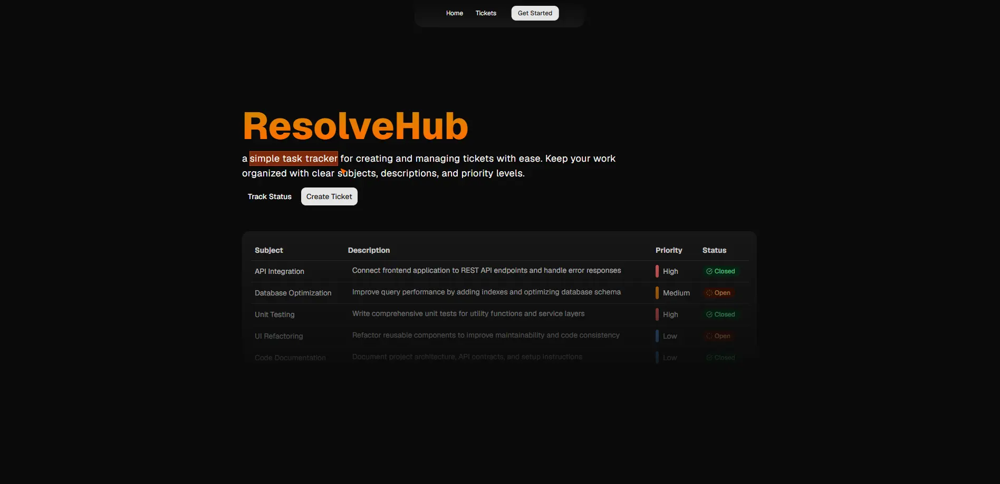

# ResolveHub

<p align="center">
  
</p>

<h3 align="center">Simple Task Tracking Made Easy</h3>

<p align="center">
    ResolveHub is a lightweight task tracking app for organizing everyday work. It lets you create and manage simple tickets with priority levels, helping you keep tasks clear, structured, and easy to follow.
</p>

---

## ✨ About

ResolveHub is a personal project built by following the excellent crash course by **Traversy Media**:

📺 https://www.youtube.com/watch?v=NKiTlo_dgb8

While the tutorial mainly focuses on learning technologies such as **Prisma**, **Neon**, and **Sentry**, I made several improvements beyond the original project, including:

- 🎨 Completely redesigned UI
- 🔒 Enhanced type safety throughout the application
- 🌱 Integrated **T3 Env** for environment variable validation
- ✨ Configured **Prettier** with import sorting
- 📌 Added enums for ticket priority and status for better consistency
- 🎫 Changed ticket details from a dedicated page into a modal/dialog experience
- ⚡ General code cleanup and project structure improvements

## 🚀 Features

- 🔐 Custom Authentication & Authorization
- 👤 User Registration & Login
- 🎫 Create support tickets
- 📋 Display all user tickets
- 🎫 View ticket details in a modal/dialog
- ✅ Close completed tickets
- 🛡️ Protected routes using Next.js `proxy.ts` (middleware)
- 🚦 Ticket Priority & Status management
- 🌙 Modern responsive UI

## 🛠️ Tech Stack

### Frontend

- Next.js 16
- React 19
- TypeScript
- Tailwind CSS v4
- Radix UI
- Motion
- Lucide React
- Sonner
- Next Themes

### Backend

- Next.js Server Components
- Server Actions
- Prisma ORM
- PostgreSQL
- Neon Database
- Custom JWT Authentication
- bcryptjs

### Validation & Utilities

- Zod
- T3 Env
- clsx
- class-variance-authority
- tailwind-merge

### Monitoring

- Sentry

### Development Tools

- ESLint
- Prettier
- Prettier Tailwind Plugin
- Sort Imports Plugin

## ⚙️ Installation

Clone the repository

```bash
git clone https://github.com/nmrisrl11/support-ticketing-web-app.git
```

Navigate into the project

```bash
cd support-ticketing-web-app
```

Install dependencies

```bash
npm install
```

Configure environment variables

```env
SENTRY_AUTH_TOKEN=
DATABASE_URL=
AUTH_SECRET=
```

Generate Prisma Client

```bash
npm run prisma:generate
```

Run database migrations

```bash
npm run prisma:migrate
```

Start the development server

```bash
npm run dev
```

## 📜 Available Scripts

```bash
npm run dev              # Start development server
npm run build            # Build production application
npm run start            # Start production server

npm run lint
npm run lint:fix

npm run format
npm run format:check

npm run prisma:migrate
npm run prisma:generate
npm run prisma:local

npm run doctor
npm run lens:web
```

## 📚 What I Learned

This project helped reinforce my understanding of:

- Authentication & Authorization
- Next.js App Router
- Route protection using middleware (`proxy.ts`)
- Prisma ORM
- PostgreSQL with Neon
- Error monitoring using Sentry
- Type-safe backend development
- Environment variable validation with T3 Env
- Clean project architecture
- Building reusable UI components with Radix UI

## 🙏 Credits

This project was inspired by and built while following:

**Traversy Media**

**Build a Support Ticket App with Next.js, Prisma, Neon & Sentry**

https://www.youtube.com/watch?v=NKiTlo_dgb8

The application has been customized with a different UI, additional improvements, and enhanced type safety.

## 📄 License

This project is for educational and portfolio purposes.
